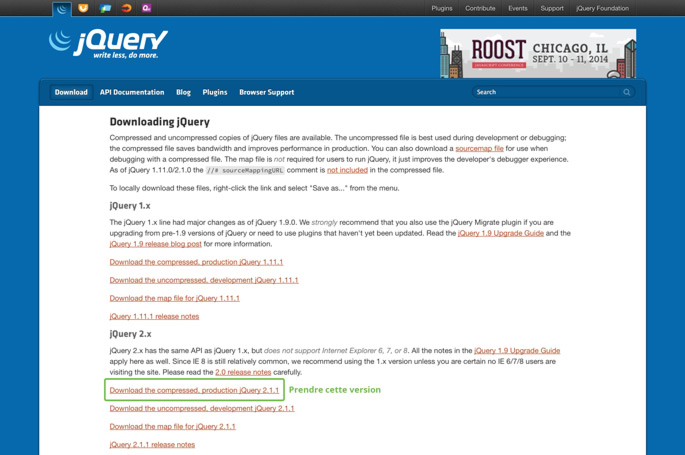

# Installation

jQuery est une bibliothèque JavaScript qui n'est pas installée de base dans votre navigateur. Il faut l'ajouter par le biais d'un fichier ayant pour extension `.js`.

Pour l'utiliser dans une page HTML, il faut lier le fichier jQuery par le biais de la balise `script`.

```html
<head>
    <script src="jquery-2.1.1.min.js"></script>
</head>
```

## Installation locale

L'installation en local est idéale si vous n'avez pas toujours accès à internet ou si votre connexion n'est pas très rapide.

Nous verrons par la suite que ce n'est pas la solution optimale pour une utilisation en production.

Vous avez besoin de télécharger le fichier sur le site officiel de jQuery : [Télécharger jQuery](http://jquery.com/download/)



Vous pouvez vous rendre compte qu'il existe plusieurs versions de jQuery. Mi 2013 jQuery est passé en version 2.XX laissant de côté la compatibilité avec les versions antérieures d'Internet Explorer 8, allégeant aussi son poids.

Ne prenez pas peur, vous n'aurez pas à modifier ces fichiers, vous devez juste y faire référence dans votre HTML pour l'installation.

Vous trouverez deux versions du même fichier :

1. un nommé "jquery-2.1.1.js"
2. un autre nommé "jquery-2.1.1.min.js"


La version **'2'** avec le suffixe **min** est une version minifiée du fichier de base. C'est-à-dire une version où les commentaires, les espaces et les tabulations ont été supprimées pour réduire le poids du fichier (chargement plus rapide).

Voici l'installation avec le script dans le header :
```html
<!DOCTYPE html>
<html lang="fr">
<head>
	<meta charset="UTF-8">
	<title>Installation de jQuery</title>
	<link rel="stylesheet" href="css/styles.css">
	<script src="js/jquery-2.1.1.min.js"></script>
</head>
<body>
	<!-- Contenu de la page -->
</body>
</html>
```

**Vous pouvez faire l'import de jQuery avant la balise de fermeture `</body>` :**

Cette technique améliore la vitesse de chargement du site internet.

```html
<!DOCTYPE html>
<html lang="fr">
<head>
    <meta charset="UTF-8">
    <title>Installation de jQuery</title>
    <link rel="stylesheet" href="css/styles.css">
</head>
<body>
    <!-- Contenu de la page -->
    <script src="js/jquery-2.1.1.min.js"></script>
</body>
</html>
```

Bien évidement, il faudra placer nos fichiers utilisant la librairie jQuery en dessous de son appel.

## Installation de jQuery distante

La manière la plus courante et aussi la plus utilisée est de passer par un CDN.

Le fichier est mis à disposition sur de multiples serveurs à travers le monde. Ces serveurs sont souvent plus rapides et économisent aussi votre bande passante. L'autre avantage est que de très nombreux sites utilisent cette méthode, donc le fichier jQuery est surement déjà en cache chez votre utilisateur.

Il existe plusieurs CDN pouvant vous fournir le fichier :

1. CDN jQuery : [http://code.jquery.com/jquery-2.1.1.js](http://code.jquery.com/jquery-2.1.1.js)
2. CDN Google : [http://ajax.googleapis.com/ajax/libs/jquery/2.1.1/jquery.min.js](http://ajax.googleapis.com/ajax/libs/jquery/2.1.1/jquery.min.js)

Pour faire l'installation, il suffit donc de remplacer le chemin du fichier en local par l'URL du CDN.

```html
<script src="http://ajax.googleapis.com/ajax/libs/jquery/2.1.1/jquery.min.js"></script>
```

## Conclusion

1. Pour le développement de votre site, utilisez jQuery en local pour la rapidité d'exécution.
2. Pour la production, passez par un CDN afin d'utiliser le cache de vos utilisateurs.
3. Placez vos scripts en fin de page, pour optimiser le chargement de la page.
