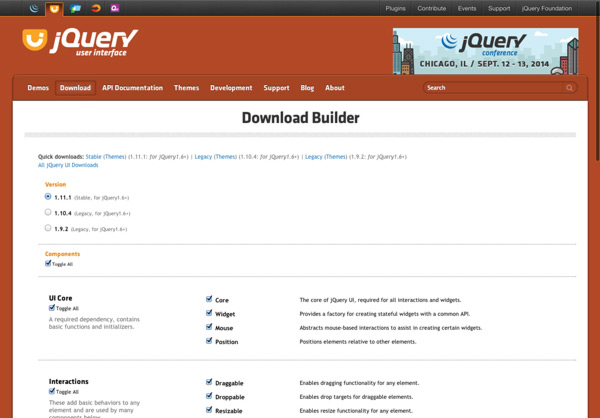

# Installation jQuery UI

Comme la bibliothèque jQuery, jQuery UI n'est pas installé par défaut dans votre navigateur, il va donc falloir l'importer de la même manière que jQuery.

## Télécharger jQuery UI

Aller sur lien : http://jqueryui.com/download/



Vous pouvez importer la bibliothèque en entier ou seulement les modules indispensables à votre projet, afin d'optimiser la vitesse de chargement de votre site.

## Installation

De la même manière que pour jQuery, jQuery UI est un fichier JS à insérer dans votre document. Vous pouvez faire l'importation dans le header ou en bas de la page.

jQuery UI a aussi besoin d'un fichier CSS pour fonctionner. Bien entendu, pour la mise en production il est conseillé de concaténer les CSS

```html
<!DOCTYPE html>
<html lang="fr">
<head>
    <meta charset="UTF-8">
    <title>Installation de jQuery</title>
    <link rel="stylesheet" href="css/styles.css">
    <link rel="stylesheet" href="css/jquery-ui.min.css">
    <script src="js/jquery-2.1.1.min.js"></script>
    <script src="js/jquery-ui.min.js"></script>
</head>
<body>
    <!-- Contenu de la page -->
</body>
</html>
```
